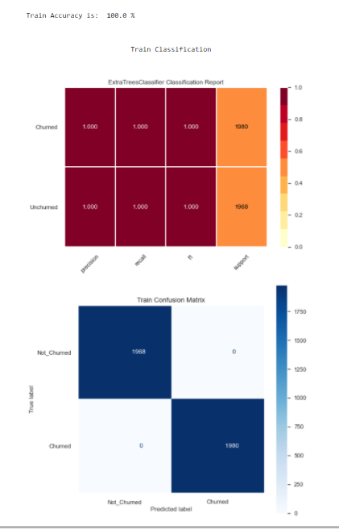
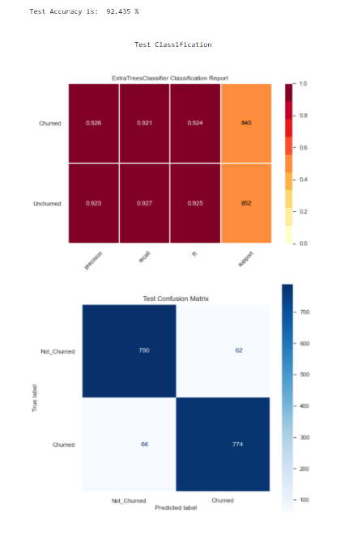

<p align="right">  </p>
<p align="center">  </p>
<h1 align="center"> CHURN PREDICTION PROJECT </h1>

In collaboration with [Rachael](https://github.com/Bamy-dev)  

## Context
With the rapid development of telecommunication industry, the service providers are inclined more towards expansion of the subscriber base. To meet the need of surviving in the competitive environment, the retention of existing customers has become a huge challenge. It is stated that the cost of acquiring a new customer is far more than that for retaining the existing one. Therefore, it is imperative for the telecom industries to use advanced analytics to understand consumer behavior and in-turn predict the association of the customers as whether or not they will leave the company.


## Installation


User the package manager [pip](https://pip.pypa.io/en/stable/) to install [pycaret](https://pycaret.org/)

```bash
!pip install pycaret --quiet
```
## Usage
```python
from pycaret.classification import *

models = setup(data = pc_data, target = 'Churn',normalize = True, normalize_method = 'minmax',transformation = True,
              verbose = False, html = True, train_size = 0.70,silent = True, session_id = 100, numeric_features = ['ContractRenewal', 'CustServCalls'])


best9 = compare_models(n_select = 9)
```

## Modules Used
```python
import pandas as pd
from pycaret.classification import *
import seaborn as sns
from sklearn.model_selection import train_test_split
from sklearn.metrics import confusion_matrix, accuracy_score, plot_confusion_matrix
from imblearn.over_sampling import SMOTE 
from sklearn.metrics import classification_report as class_report
from sklearn.ensemble import RandomForestClassifier,GradientBoostingClassifier,ExtraTreesClassifier
from sklearn.linear_model import LogisticRegression
from sklearn.preprocessing import StandardScaler, MinMaxScaler
from sklearn.tree import DecisionTreeClassifier
from catboost import CatBoostClassifier
from yellowbrick.classifier import classification_report
from sklearn.svm import SVC
import numpy as np
from sklearn.impute import KNNImputer
import matplotlib.pyplot as plt
sns.set()
```

## Best Performing Model





