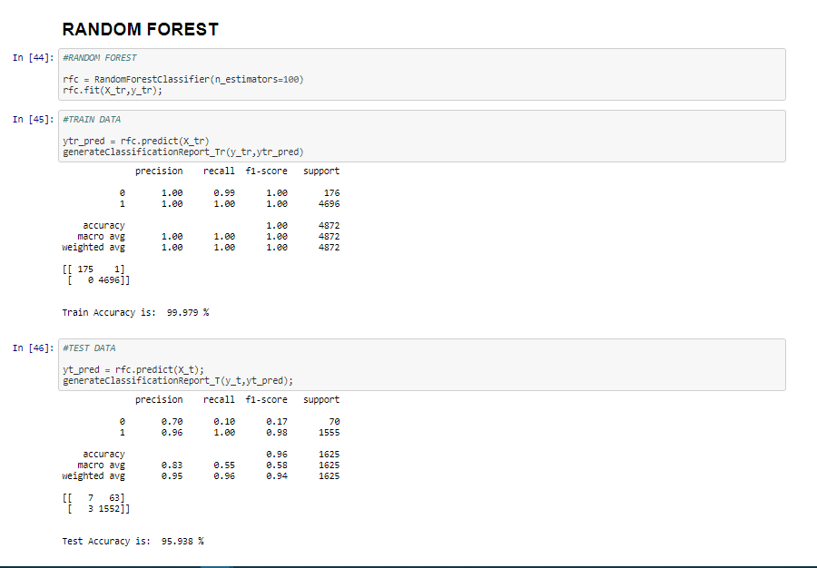

<p align="center">  </p>
<h1 align="center"> WINE QUALITY PREDICTION PROJECT </h1>


## Context
A wine bottling company has a lab where they test wine quality.
The company wants to be able to predict the marketability of any new wine sample they get from a vineyard before they commit to marketing it.
Create a machine learning model to predict the quality score of a given wine sample.


## Modules Used
```python
import numpy as np
import seaborn as sns
from IPython.display import display
from sklearn.metrics import confusion_matrix,accuracy_score,classification_report
from sklearn.model_selection import train_test_split, GridSearchCV
from sklearn.preprocessing import StandardScaler
from sklearn.linear_model import LogisticRegression
from sklearn.ensemble import RandomForestClassifier
from sklearn.naive_bayes import GaussianNB
from sklearn.svm import SVC
from sklearn.tree import DecisionTreeClassifier
from sklearn.linear_model import SGDClassifier
%matplotlib inline
```

## Best Performing Model



